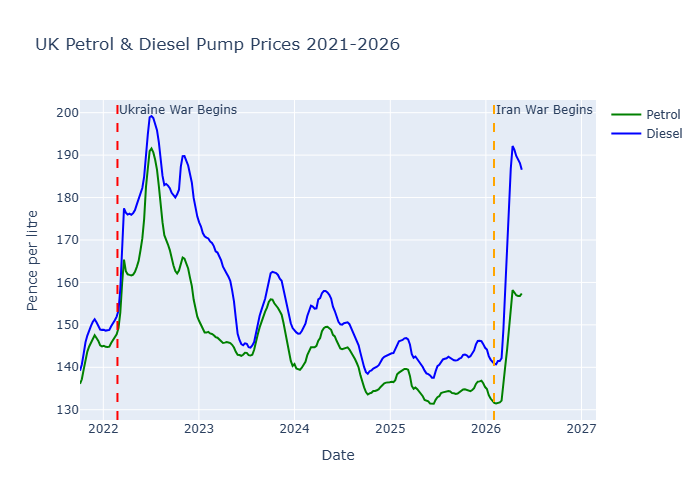
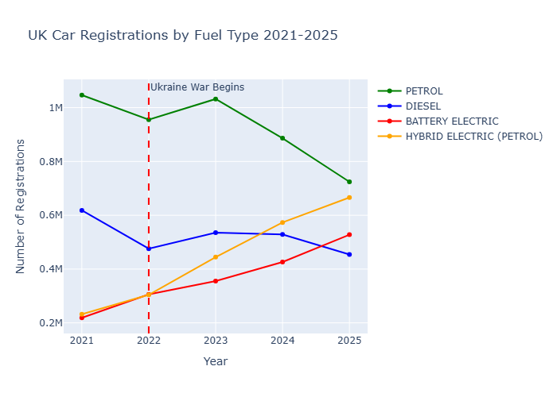
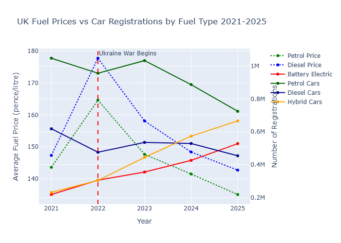
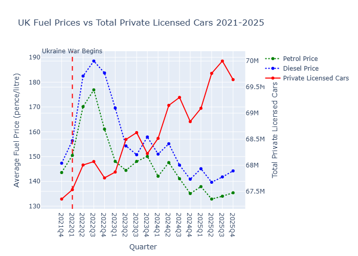

# UK-fuel-prices-ev-analysis
Analysis of UK fuel prices and car registrations in relation to geopolitical events.

# UK Fuel Prices & EV Adoption Analysis

An analysis of UK pump prices and car registration trends in relation 
to the Russia-Ukraine war (2022) and Iran war (2026).

## Key Findings
- UK pump prices spiked sharply after both conflicts
- The shift from petrol/diesel to EVs and hybrids was already underway 
  before either conflict and continued regardless of price volatility
- No clear short term correlation between fuel price spikes and EV adoption

## Data Sources
- Weekly pump prices: Department for Energy Security and Net Zero
- Vehicle registrations: Department for Transport (VEH0270)
- Private licensed vehicles: Department for Transport (VEH0125) — 
  download from https://www.gov.uk/government/statistical-data-sets/vehicle-licensing-statistics-data-files
Due to file size limitations, `df_VEH0125.csv` is not included in this repository. 
It can be downloaded directly from the Department for Transport vehicle licensing 
statistics page: https://www.gov.uk/government/statistical-data-sets/vehicle-licensing-statistics-data-files

## Tools Used
Python, Pandas, Plotly, Jupyter Notebook

## Charts

### UK Petrol & Diesel Pump Prices 2021-2026

### UK Car Registrations by Fuel Type 2021-2025

### UK Fuel Prices vs Car Registrations

### UK Fuel Prices vs Total Private Licensed Cars

